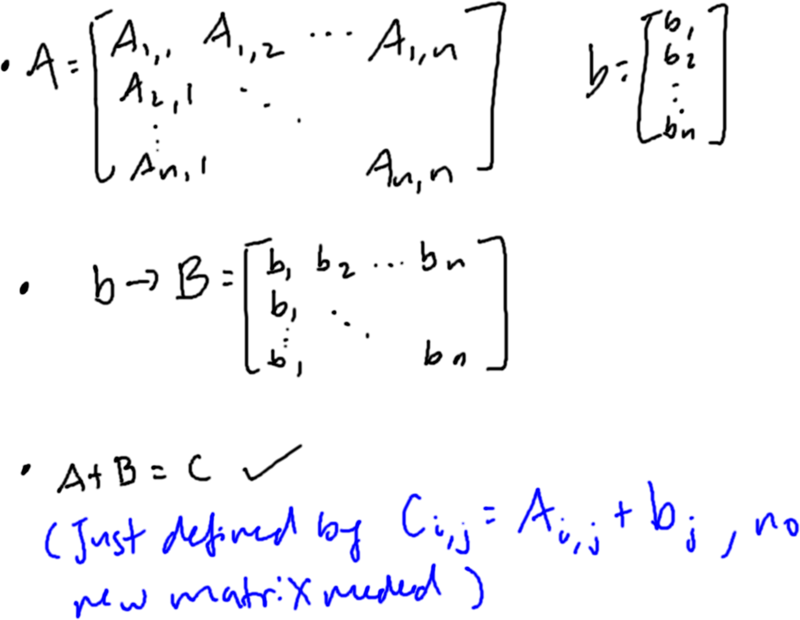
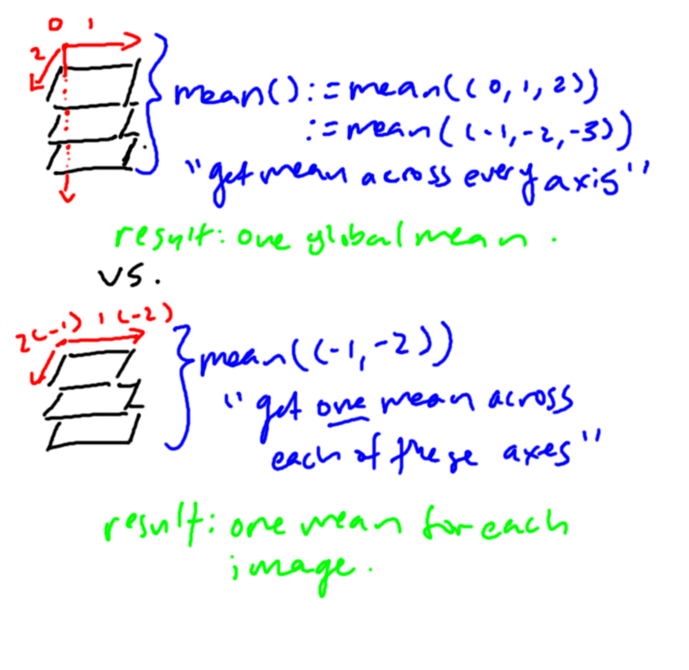
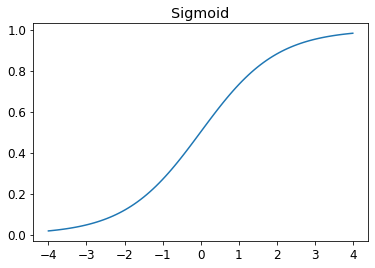
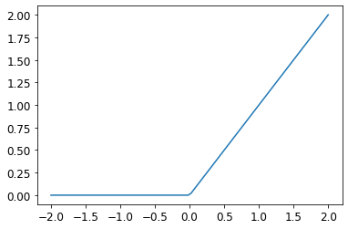
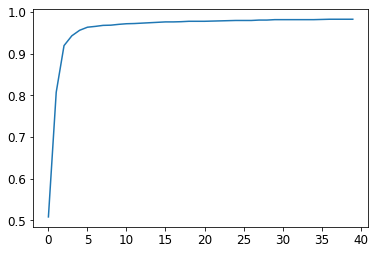

# Download and Visualize Data

We begin by downloading a sample of mnist's data. This data is just images of 3s and 7s. 
We also print out the path which the data is contained.

Note that the vast majority of the code is commented out, because those comments contain code for 
visualizing relevant functions. Just uncomment if you want to visualize any particular function 
being run.

```python
path = untar_data(URLs.MNIST_SAMPLE)
print(path.ls())
print((path/'train').ls())
```

Next, we'll create two lists: a sorted list that contains the path of the 3s, and another one for 
the 7s. Afterwards, we confirm by printing out the top 3 elements of the threes list.

```python
threes = (path/'train'/'3').ls().sorted()
sevens = (path/'train'/'7').ls().sorted()
print(threes[:10])
```

Now, we'll visualize the data. We grab an element from `threes`, which is a path to an image, 
and crack it open for viewing.

```python
im3_path = threes[1]
im3 = Image.open(im3_path)
im3.show()
```

After looking at this image, we take at look at different representations of the image. 
Since an image is fundamentally a matrix of pixels, we can visualize the data as a numpy array, 
as well as a tensor.

```python
print(array(im3)[4:10,4:10]) # views rows from [4,10) and cols from [4,10)
print(tensor(im3)[4:10,4:10])
```

Then, we'll use a pandas dataframe to color code values using a gradient. 
Since each pixel is just a numerical value, we can use these values to make a greyscale image.

```python
im3_t = tensor(im3)
df = pd.DataFrame(im3_t[4:26,4:22])
df_formatted = df.style.set_properties(**{'font-size':'6pt'}).background_gradient('Greys')
```

To view this image, we generate an html file that draws it.

```python
with open('pixel_image.html', 'w') as image:
    df_formatted.to_html(image)
filename = 'pixel_image.html'
webbrowser.open_new_tab(filename)
```


# Attempting to Classify the Images

## Pixel Similarity

In this attempt, we will try to create a rough estimate for what a three and a seven should look 
like, based on the data that we were given. Then, we will compare our test data with that average 
three/seven, and see how close they are; the closer they are, the more likely it is that they are 
the three or seven.

We convert each image into a tensor, using Python List Comprehension 
(neat trick that has shorter syntax to create a new list based on the values of an existing list).

For this particular case: for every image in the list of sevens/threes, open the image and convert 
it into a tensor. This creates a list of tensors of our seven/three images. 
We print the lengths of the lists and view a table of the tensor to confirm that we're on the right 
path.

```python
seven_tensors = [tensor(Image.open(o)) for o in sevens]
three_tensors = [tensor(Image.open(o)) for o in threes]
print(len(three_tensors),len(seven_tensors))
show_image(three_tensors[1], cmap='binary')
plt.show()
```

Next, we will compute the average of each pixel by stacking the tensors into a rank 3 tensor 
(or a 3D tensor). Then we convert the tensors from `int` to `float`, so our averaging doesn't 
result in integer division. We divide by 255, so they're in the range of 
`[0,1]` instead of `[0,255]`. 

```python
stacked_sevens = torch.stack(seven_tensors).float()/255
stacked_threes = torch.stack(three_tensors).float()/255
```

By the way, here's some tensor jargon:
- `print(stacked_threes.shape)` are 6131 28x28 images stacked as a 3D tensor
- `print(len(stacked_threes.shape))` is the length of a tensor's shape. 
This is the same as the rank of the tensor
- `print(stacked_threes.ndim)` the rank of a tensor (ndim) = number of axes in a tensor 

Finally, we compute the "ideal" 3 and 7. This is done by computing the mean on the "horizontal" 
direction; this isn't a global mean of ALL values, that wouldn't tell us anything except how much 
the image is marked. In this case, our mean is made of 1 pixel per image; 
for example, we are taking the mean of all 6131 pixel values in `(0,0)`.

```python
mean3 = stacked_threes.mean(0)
mean7 = stacked_sevens.mean(0)

show_image(mean3, cmap='binary')
plt.show()
show_image(mean7, cmap='binary')
plt.show()
```

Now we test: we'll compare the distance between a sample 3 and the ideal 3 and 7. This can be done 
two ways - the L1 norm or the L2 norm. There is a whole discussion on when to use what norm 
(L1 is better for distances between zero and other small, non-zero elements since L2 grows slowly 
near the origin, which has implications for things like feature extraction, etc.). 
`dist7` should be larger than `dist3`, since the sample 3 should be "closer" to the ideal 3 than 
the ideal 7.

```python
# sample 3 and 7
a_3 = stacked_threes[1]
a_7 = stacked_sevens[1]

# distance b/t a datapoint and the ideals
dist3_abs = (a_3 - mean3).abs().mean()
dist3_sqr = ((a_3 - mean3)**2).mean().sqrt()

dist7_abs = (a_3 - mean7).abs().mean()
dist7_sqr = ((a_3 - mean7)**2).mean().sqrt()

print(dist3_abs, dist3_sqr)
print(dist7_abs, dist7_sqr)
```

PyTorch offers functions for calculating these as loss functions under `torch.nn.functional`, 
and the team recommends importing that as `F`. 
We don't have to since fastai makes it available under that name by default.

`print(F.l1_loss(a3.float(), mean7), F.mse_loss(a_3, mean7.sqrt()))`
- `F.l1_loss` obviously refers the L1 norm, or mean absolute error in this case. 
- `F.mse_loss` refers to the mean squared error, which we then follow up with a square root to get 
our root mean sqaured error (RMSE).

## Computing Metrics Using Broadcasting

At this point, we're looking to test our model against some data it's never seen. 
Of course, for the pixel similarity method, we dont' really need a validation set since there's no 
actual training happening. Still, we'll follow these practices (and we'll eventually need to do it 
with trained models in the future).

We'll start by going into our validation set folder, and creating a tensor out of each image. 
We cast the elements to float and divide by 255 so each element is in the range of [0,1]. 
The shape of each tensor reveals roughly 1000 28x28 pixel images per label.

```python
valid_3_tens = torch.stack([tensor(Image.open(o))
                            for o in (path/'valid'/'3').ls()])
valid_3_tens = valid_3_tens.float()/255

valid_7_tens = torch.stack([tensor(Image.open(o))
                            for o in (path/'valid'/'7').ls()])
valid_7_tens = valid_3_tens.float()/255
print(valid_3_tens.shape, valid_7_tens.shape)
```

We will eventually need a function that we can call to measure the distance between the ideal image 
and our test image:

`def mnist_distance(a,b): return (a-b).abs().mean((-1,-2))`

### Broadcasting

We'll come back to what the `(-1,-2)` tuple in `mean()` means after this. 
First, we should be concerned about how to get the distance between every element in the 
validation set and the ideal image. We could use a for loop, calculating the distance between 
each image in the set in our stacked tensor withe ideal image - or we could just pass in 
that stacked tensor:

```python
valid_3_dist = mnist_distance(valid_3_tens, mean3)
print(valid_3_dist, valid_3_dist.shape)
```

This prints out a tensor that is the exact size of the stacked tensor - no for loop required! 
How? PyTorch uses a method called broadcasting. When subtraction between two tensors of different 
ranks occurs, PyTorch automatically expands the tensor with the smaller rank to match the tensor 
of the larger rank - this makes tensor code easier to write.



Note that PyTorch isn't actually allocating memory to create a larger-ranked tensor from the 
smaller-ranked tensor; that's wholly unnecessary. The operation we defined above allows us to 
pretend that we're working with two tensors of the same rank without creating a new tensor of 
that larger rank.

### What the `mean()` Doing?

The `(-1,-2)` ordered pair is important. Note that eventually, we will be computing the distance 
between our entire validation set of images to the ideal image; that entails passing a 
rank-3 tensor. If we were to just compute the distance, `mean` would get the mean distances of 
all the images in the validation set, then calculate the mean of all those distances, 
returning one value. What we want is a vector of the distances between each image in the set 
and the ideal image.

To communicate that, `mean((-1,-2))` says to calculate the mean ranging over the values indexed 
by the last and second to last axes of the tensor. For our rank-3 tensor, that would be the 
horizontal and vertical dimensions, since it would be indexed as `(image number, horizontal pixel, 
vertical pixel)`, as given by `torch.shape`. So the tuple could be `(1,2)` or `(-1,-2)`; 
either way, we just need to tell the mean function to only get the mean out of each image. 
Here's an image to help visualize the function:



### Computing Accuracy

Continuing on, we want to determine if an image is a 3 or a 7; a simple way to implement that is 
to compare the distance our sample is from the ideal 3 and 7, and say whatever label that 
sample is closer to is the label our sample should be - and thanks to broadcasting, we can 
pass in the full validation set, not just one element of it:

```python
def is_3(x): return mnist_distance(x, mean3) < mnist_distance(x, mean7)
print(is_3(a_3), is_3(a_3).float())
print(is_3(valid_3_tens))
```

Now, all that remains is to calculate the accuracy of our simple model against the validation set:

```python
accuracy_3s = is_3(valid_3_tens).float().mean()
accuracy_7s = (1 - is_3(valid_7_tens).float()).mean()
print(accuracy_3s, accuracy_7s, (accuracy_3s+accuracy_7s)/2)
```

Here we get accuracies in excess of 90%, so that's neat. But these are only two digits, and 
very distinct ones at that. Further on we'll investigate stochastic gradient descent, so 
our model can do some actual learning.

# MNIST Loss Function

## Preparing the data and their labels

Recall that our data is currently formatted as a list of matrices, via `stacked_threes` and 
`stacked_sevens`. We need to convert this list of matrices into a list of vectors; this process 
of converting an `m x n` matrix to a `mn x 1` column vector is called **vectorization**, which 
stacks the columns of a matrix on top of each other. 
This makes for faster computation because matrix multiplication would require for-loops. 
But with two vectors, we can just compute the product between the vector of weights and the 
vector of inputs, which is a job that is incredibly easy to parallelize. 
[[1]](https://medium.com/@jwbtmf/vectorization-in-deep-learning-c47f0d171d0a)

More on vectorization:

>Basically, between python for loop and vectorized numpy arrays, the for loop is in raw python 
>that gets interpreted; loops assess the type of the operands at each iteration, which 
>introduces a severe amount of computational overhead. Meanwhile, numpy uses BLAS (basic linear 
>algebra subprograms) written in c/fortran that has incredibly optimized and low-level linear 
>algebra operations. Finally, vector operations can also be done in parallel using the SIMD 
>paradigm, further introducing performance gains unaccessible to raw python for loops.
>[[2]](https://www.r-bloggers.com/2018/05/machine-learning-explained-vectorization-and-matrix-operations/) 
>[[3]](https://en.wikipedia.org/wiki/Basic_Linear_Algebra_Subprograms)

```python
train_x = torch.cat([stacked_threes, stacked_sevens]).view(-1, 28*28)
```

Continuing on, we collect our training data under `train_x`, where we create a tensor with 
`stacked_threes` concatenated with `stacked_sevens`. The `view(-1, 28*28)` function 
reshapes/vectorizes this tensor, with `-1` denoting "make this axis as large as necessary to fit 
the data". The result is a list of vectors; in this case, a tensor of the shape `(12396, 784)`, 
denoting 12396 images, each as a vector of 784 pixels.

Of course, we also need to label the data; we'll choose `1` for threes and `0` for sevens.

```python
train_y = tensor([1]*len(threes) + [0]*len(sevens)).unsqueeze(1)
```

Decoding this python nonsense, `[1]*len(threes)` generates a list of size `len(threes)` whose 
elements are initialized to `1`. The addition of `[0]*len(sevens)` concatenates that list with a 
list of size `len(sevens)` whose elements are initialized to `0`. The next function, 
`unsqueeze(1)`, adds a dimension of size 1 at index 1, converting our list of 12396 into a 
proper tensor of shape `[12396, 1]`, matching the rank of our training data.

```python
print(train_x.shape, train_y.shape)
```

`torch.Size([12396, 784]) torch.Size([12396, 1])`

We'll match the training data with the training labels, by forming a pair between each image 
and label in the form `(image, label)`, which can be done using the `zip()` function. We then 
store each of these pairs into a list called `dset` using `list()`. 
Recall that each image was vectorized into vectors of size 784, and that a label is either 1 or 0. 
So each pair will be a rank 1 tensor of size 784 of values from 0 to 1, and a rank 0 tensor of 
value either 0 or 1.

```python
dset = list(zip(train_x, train_y))
x,y = dset[0]
print(x.shape, y)
```

`torch.Size([784]) tensor([1])`

Finally, we'll prepare the validation set and their labels in the same manner as above.

```python
valid_x = torch.cat([valid_3_tens, valid_7_tens]).view(-1, 28*28)
valid_y = tensor([1]*len(valid_3_tens) + [0]*len(valid_7_tens)).unsqueeze(1)
valid_dset = list(zip(valid_x, valid_y))
```

## SGD

Now we'll begin the stochastic gradient descent process. First, we'll need to randomly 
initialize our weights for every pixel.

### init

Recall that on top of initializing random weights, we also need to inclue a bias 
`y = mx + b` since `weights * pixels` alone is not flexible enough, since it will always be 
0 if the pixels are 0. Together, the *weights* and the *bias* make up the *parameters*.

```python
def init_params(size, std=1.0): return (torch.randn(size)*std).requires_grad_()
weights = init_params((28*28, 1))
bias = init_params(1)
```

### predict

First, let's see a prediction for a single image in our training set.

```python
print((train_x[0]*weights.T).sum() + bias)
```

`tensor([-6.2330], grad_fn=<AddBackward0>)`

Here `weights.T` is just the transpose of `weights`, converting the column vector into a row 
vector. That way, we're doing element-wise vector multiplication.

Now, there is a temptation to use for loops to calculate the predictions for all the images 
in the training data. However, we're talking about python here - this is a huge mistake. We 
want to convert this into a matrix multiplication problem and let BLAS do the work (see the 
previous discussion above on vectorization).

```python
def linear1(xb): return xb@weights + bias
preds = linear1(train_x)
print(preds)
```

```
tensor([[ -6.2330],
        [-10.6388],
        [-20.8865],
        ...,
        [-15.9176],
        [ -1.6866],
        [-11.3568]], grad_fn=<AddBackward0>)

```

This equation, `batch @ weights + bias`, is one of the two fundamental equations of any neural 
network, so it's worth understanding to the fullest.

Using broadcasting (no loops), we can also check the accuracy of our predictions:

```python
corrects = (preds>0.0).float() == train_y
```

That is, get our tensor of predictions; for every element greater than 0, mark it as true; else 
mark it as false. Then convert those T/F values into floats, or 1.0/0.0, and mark it as true 
if it matches the corresponding element value in `train_y`. The result is a tensor of T/F 
values, where true means the prediction for that image was correct, false if otherwise. In other 
words, a tensor of prediction accuracies.

```python
print(corrects)
```

```
tensor([[False],
        [False],
        [False],
        ...,
        [ True],
        [ True],
        [ True]])
```

We then get the tensor of prediction accuracies, convert their elements to float, get the mean of 
the tensor, giving us a scalar. We use `item()` to convert a scalar tensor into a standard Python 
number - in this case, the accuracy of the model's predictions as a whole.

```python
print(corrects.float().mean().item())
```

```
0.5379961133003235
```

Here, we'll see what changes to one weight does to the accuracy:

```python
with torch.no_grad(): weights[0] *= 1.0001
preds = linear1(train_x)
print(((preds>0.0).float() == train_y).float().mean().item())
```

```
0.5379961133003235
```

>Note that we don't need to recalculate gradients here since we're just testing a weight change, 
>not doing the process of getting gradients to find out where our weights should be moved.

### loss (that gradient is calculated on)

Now that we can make predictions, we need to create a loss function that measures how good 
our weights are at producing results, that we can then calculate gradients on.

We already have accuracy as our metric, and it would be reasonable to assume it would make for 
a good loss function. However, the issue is accuracy is binary - the model either gets the 
solution or it doesn't - there is no concept of "getting closer" to the solution, but 
falling short, while recognizing we're going in the right direction. It's like if a professor 
graded your test by marking the wrong answers, without giving explanations for why you got 
something wrong. In the context of our loss function, that would essentially mean that 
such change to weights don't really change the loss function's curve; that is, our 
gradient is 0 almost everywhere. Much like how you can't learn from a test that is marked without 
explanations, the model will not be able to learn if different weight values don't change the 
loss curve.

>Mathematically the loss function with the accuracy metric would look like a step function; the 
>derivative at any point is either 0 or infinity. If the derivative is 0, then we don't know if 
>we should increase or decrease the weights to get a minimum.

So instead of a binary yes/no prediction, we'll turn to probabilities to craft our loss 
function. Fundamentally, a loss function is meant to measure the "distance" between a 
prediction and reality. Instead of 0 and 1 prediction for our image, what if we instead 
had a confidence interval? For example, instead of guessing if an image is a 3, the model 
instead gave a number between 0 and 1 that represents *confidence* that the image is a 3. 
That is, a model giving 0.75 for an image means it's more confident it's a 3 than an image 
marked as 0.25.

Let's take a shot at defining a loss function of this kind:

```python
trgts = tensor([1,0,1])
prds = tensor([0.9,0.4,0.2])

def mnist_loss(predictions, targets):
    return torch.where(targets==1, 1-predictions, predictions).mean()
```

Here `trgts` represents if the image is actually a 3 or a 7. Then `prds` would be the alleged 
predictions on what the images are in terms of how confident it is. So for the first image the 
model is 90% confident it's a 3, but for the 3rd image it's only 20% confident.

As for `torch.where(a,b,c)`, this function is the same as Python's list comprehension, 
except done on tensors using C/CUDA speed. That is, this is the same as the piecewise function:  

`myList[i] = b[i] if a[i]==True else c[i] for i in range(len(a))`. 
[[4]](https://pytorch.org/docs/stable/generated/torch.where.html)

In the context of our loss function, we're telling PyTorch to make a tensor whose elements are 
`1-prds[i]` if `trgts[i]==1`, else use `prds[i]`. We write our tensor like this because we 
want to have each element be the distance from 0 if it should be 0, and the distance from 1 if 
it should be 1, so now we achieved our goal of getting the elements of the tensor to show the 
distance between the prediction and the target, not distance between only 0 or only 1.

```python
print(torch.where(trgts==1, 1-prds, prds))
```
`tensor([0.1000, 0.4000, 0.8000])`

And of course, since the loss function is a multivariate function with one output, we return 
the mean of these distances as a rank 0 tensor (scalar). We can also see that by moving the 
third image prediction from 0.2->0.8 (closer to the target 1), that loss declines, as expected.

```python
print(mnist_loss(prds,trgts))
print(mnist_loss(tensor([0.9,0.4,0.8]),trgts))
```

```
tensor(0.4333)
tensor(0.2333)
```

#### sigmoid

While using confidence is nice, our current setup assumes that the predictions are between 
0 and 1, which definitely not the case as you can see from the previous predictions that we 
made. Thus we need to fit our predictions in such a manner that matches our expectations.

To do this, we turn to the sigmoid function:

```python
# actual function
def sigmoid(x): return 1/(1+torch.exp(-x))

# using torch's implementation
plot_function(torch.sigmoid, title='Sigmoid', min=-4, max=4)
plt.show()
```


Some important characteristics of this function includes: 
- Output is in the range of 0 and 1
- Output *saturates* when the input is very positive or negative; meaning at more extreme values 
the function is flat and insensitive to change

Applied to our loss function, we have:

```python
def mnist_loss(predictions, targets):
    predictions = predictions.sigmoid()
    return torch.where(targets==1, 1-predictions, predictions).mean()
```

To recap, we unearthed the difference between a good metric and a good loss function. A good 
metric is human-readable and shows us how the model is performing, and a good loss function 
is a measure of how well the model is performing + meaningful derivatives. In our case, metrics 
as a loss function hid "progress" and can't help our model learn. Put simply, loss is for 
learning and metrics are for judging.

### step (optimization)

Recall weights and input plus bias make the prediction, and the loss function is a measure 
of how far the prediction is from reality. Our loss function can be generated using one input, 
or perhaps loss can be calculated for the entire dataset and a point on the curve would be 
the average of all those losses. However, both methods are dangerous.

First, using only one data point to guide your loss function leaves you susceptible to 
huge error - what if the data point you happen to choose is some terrible outlier? You 
don't want to use these outliers to teach your model.

Second, calculating the average loss over an entire data set is unteneable for large data 
sets; it would simply take too long.

So if 1 data point is too imprecise and all data points is too time-consuming, what is the 
middle ground? Mini-batches provide the solution.

Mini-batches are a sample of the data set, and we take calculate the average loss over this 
sample. The larger the batch size, the more accurate the loss; but the more computation time 
is required. 

Your choice in hardware also determines how large your batch size can/needs to be. Ideally 
you can choose a batch size that makes full use of your GPU, but doesn't exceed its memory 
limitations.

To select data for our mini-batches, we want random samples - so we use `DataLoaders` to 
do shuffling and mini-batch collation, like so: 

```python
coll = range(15)
dl = DataLoader(coll, batch_size=5, shuffle=True)
print(list(dl))
```

`[tensor([ 3, 12,  8, 10,  2]), tensor([ 9,  4,  7, 14,  5]), tensor([ 1, 13,  0,  6, 11])]`

Here we generated a list of numbers from 0 to 14, defined a batch size of 5 
(so 3 batches of size 5), and shuffled the numbers.

Another thing to mention is that we're not just using normal Python collections, but a 
collection of independent variables (inputs) and dependent variables (targets) - so we'll 
need the ability to have a collection of tuples containing our inputs and targets, managed 
by PyTorch's `DataSet`. This `DataSet` object is then passed into a `DataLoader`; here's a 
simple example with inputs as integers and targets as characters.

```python
ds = L(enumerate(string.ascii_lowercase))
dl = DataLoader(ds, batch_size=6, shuffle=True)
print(ds)
print(list(dl))
```

```
[(0, 'a'), (1, 'b'), (2, 'c'), (3, 'd'), (4, 'e'), (5, 'f'), (6, 'g'), (7, 'h'), (8, 'i'), (9, 'j'), (10, 'k'), (11, 'l'), (12, 'm'), (13, 'n'), (14, 'o'), (15, 'p'), (16, 'q'), (17, 'r'), (18, 's'), (19, 't'), (20, 'u'), (21, 'v'), (22, 'w'), (23, 'x'), (24, 'y'), (25, 'z')]

[(tensor([17, 18, 10, 22,  8, 14]), ('r', 's', 'k', 'w', 'i', 'o')), (tensor([20, 15,  9, 13, 21, 12]), ('u', 'p', 'j', 'n', 'v', 'm')), (tensor([ 7, 25,  6,  5, 11, 23]), ('h', 'z', 'g', 'f', 'l', 'x')), (tensor([ 1,  3,  0, 24, 19, 16]), ('b', 'd', 'a', 'y', 't', 'q')), (tensor([2, 4]), ('c', 'e'))]
```

# Fully implementing gradient descent

## What happens at each epoch

The goal of this section is to implement the gradient descent process; or defining what 
happens at each epoch. We want something like this: 

```python
for x,y in dl:
  pred = model(x)                     # predict
  loss = loss_func(pred, y)           # calc loss
  loss.backward()                     # calc gradients of loss func
  parameters -= parameters.grad * lr  # update parameters, given some learning rate
```

To get here, we'll start by initializing our parameters:

```python
weights = init_params((28*28,1))
bias = init_params(1)
```

Then, we'll collect our training and validation data into DataLoader batches:

```python
dl = DataLoader(dset, batch_size=256)
valid_dl = DataLoader(valid_dset, batch_size=256)

xb,yb = first(dl) 
print(xb.shape, yb.shape)
```

`torch.Size([256, 784]) torch.Size([256, 1])`

Here we pass in the training dataset, and tell `DataLoaders` to put the images in batches of 
size 256. Recall that `dset` is a list of pairs of vectorized images and labels. By 
using `fastcore.basics.first()` we get the first element in our `DataLoaders` object, and 
find that each element is a pair with 256 vectorized images and 256 labels.

Now, we'll do a mini-batch size of 4 to test:

```python
batch = train_x[:4]
print(batch.shape)

preds = linear1(batch)
print(preds)

loss = mnist_loss(preds, train_y[:4])
print(loss)

loss.backward()
print(weights.grad.shape, weights.grad.mean(), bias.grad)
```

```
torch.Size([4, 784])
tensor([[14.0882],
        [13.9915],
        [16.0442],
        [17.7304]], grad_fn=<AddBackward0>)
tensor(4.1723e-07, grad_fn=<MeanBackward0>)
torch.Size([784, 1]) tensor(-5.9512e-08) tensor([-4.1723e-07])
```

Here, we:
- Made a batch size of 4 with the training data
- Performed predictions on this batch with our randomly initialized weights and bias
- Calculated the loss of these predictions
- Calculated the gradients of our loss function w.r.t. the parameters

Since we'll be doing this once per epoch across many epochs, we'll make a function out of this 
process:

```python
def calc_grad(xb, yb, model):
    preds = model(xb)
    loss = mnist_loss(preds, yb)
    loss.backward()
```

Testing it, we notice that if you call `calc_grad()` more than once, the gradients change 
despite the function and the inputs not changing at all.

```python
calc_grad(xb, yb, linear1)
print(weights.grad.mean(), bias.grad)

calc_grad(xb, yb, linear1)
print(weights.grad.mean(), bias.grad)
```

```
tensor(-0.0035) tensor([-0.0273])
tensor(-0.0069) tensor([-0.0546])
```

This is because `loss.backward()` adds the gradients of loss to the currently stored gradients. 
So for subsequent calls, we'll have to make sure to reset the stored gradient values using 
these lines:

```python
weights.grad.zero_()
bias.grad.zero_()
```

To round out our basic training loop for an epoch, we'll have to update the weights and 
biases based on the gradient and learning and ensure we reset the gradients right after: 

```python
def train_epoch(model, lr, params):
    for xb,yb in dl:
        calc_grad(xb, yb, model)
        for p in params:
            p.data -= p.grad * lr
            p.grad.zero_()
```

That is for each epoch, we:
- For each item in the batch, calculate the gradients (predict, loss, gradient)
- Then for every parameter in that item, update the weights (based on gradient and learning rate), 
then reset the gradients

Now we'll take on calculating accuracy and validating each epoch. On our mini-batch, it would 
be:

```python
print((preds>0.0).float() == train_y[:4])
```

```
tensor([[True],
        [True],
        [True],
        [True]])
```

As a function, we want to transform the predictions to conform to a sigmoid function, 
check the correct predictions, then return the mean: 

```python
def batch_accuracy(xb, yb):
    preds = xb.sigmoid()
    correct = (preds>0.5) == yb
    return correct.float().mean()

print(batch_accuracy(linear1(batch), train_y[:4]))
```

`tensor(1.)`

Combining the accuracies of the batches together, we get this function:

```python
def validate_epoch(model):
    accs = [batch_accuracy(model(xb), yb) for xb,yb in valid_dl]
    return round(torch.stack(accs).mean().item(), 4)

print(validate_epoch(linear1))
```

`0.9697`

That is, make a list of tensors of batch accuracies for every batch. Get the list, stack all 
the tensors into one tensor of accuracies, get the mean of all the accuracies, cast it into 
a Python number, and round it to 4 decimal places.

Finally, we'll train for a few epochs and see what happens:

```python
lr = 1.
params = weights,bias
train_epoch(linear1, lr, params)
print(validate_epoch(linear1))

for i in range(20):
    train_epoch(linear1, lr, params)
    print(validate_epoch(linear1), end=' ')
print()
```

```
0.7344
0.8687 0.9229 0.9429 0.9526 0.9595 0.9678 0.9707 0.9761 0.979 0.9805 0.9814 0.9819 0.9854 0.9854 0.9854 0.9858 0.9868 0.9868 0.9868 0.9873 
```

So we got our expected result - as we train our model, the accuracy of it improves!

## Creating an optimizer

This process is both fundamental and foundational - so it's no surprise that PyTorch already 
has some helpers for us to use to simplify our code.

### Using PyTorch

To start off with, we can replace `init_params()` and `linear1()` with PyTorch's `nn.Linear` 
module; we just need to pass in the shape of the parameters and the bias:

```python
linear_model = nn.Linear(28*28, 1)
w,b = linear_model.parameters()
print(w.shape,b.shape)
```

`torch.Size([1, 784]) torch.Size([1])`

With `nn.Linear` we can make a basic optimizer, responsible for the step and zeroing gradients: 

```python
class BasicOptim:
    def __init__(self, params, lr): self.params,self.lr = list(params), lr

    def step(self, *args, **kwargs):
        for p in self.params: p.data -= p.grad.data * self.lr

    def zero_grad(self, *args, **kwargs):
        for p in self.params: p.grad = None
```

Then we can simplify our `train_epoch()` function using the class we defined: 

```python
opt = BasicOptim(linear_model.parameters(), lr)

def train_epoch(model):
    for xb,yb in dl:
        calc_grad(xb, yb, model)
        opt.step()
        opt.zero_grad()

print(validate_epoch(linear_model))
```

`0.2129`

In this case, `validate_epoch()` doesn't need to be changed at all.

We'll then put our training loop in a function: 

```python
def train_model(model, epochs):
    for i in range(epochs):
        train_epoch(model)
        print(validate_epoch(model), end=' ')
    print()

train_model(linear_model, 20)
```

`0.4932 0.8071 0.853 0.917 0.937 0.9502 0.9595 0.9668 0.9688 0.9712 0.9731 0.9746 0.9771 0.978 0.979 0.98 0.9805 0.981 0.981 0.9819`

### Using fastai

Here we can also use fastai, which provides an SGD class that does what our `BasicOptim` class 
does:

```python
linear_model = nn.Linear(28*28, 1)
opt = SGD(linear_model.parameters(), lr)
train_model(linear_model, 20)
```

`0.4932 0.875 0.8291 0.9121 0.9355 0.9492 0.9585 0.9663 0.9692 0.9707 0.9722 0.9746 0.9771 0.978 0.979 0.979 0.9805 0.981 0.9814 0.9814`

In fact, if we have our: 
- Training and validation set in a DataLoaders object
- Choice of optimizer from fastai
- Loss function defined
- Metrics function defined
- Learning rate defined

Then we can use fastai's `Learner` class to do it all; using `Learner.fit()` to replace 
`train_model()`

```python
dls = DataLoaders(dl, valid_dl)
learn = Learner(dls, nn.Linear(28*28, 1), opt_func=SGD, loss_func=mnist_loss, metrics=batch_accuracy)
learn.fit(10, lr=lr)
```

```
epoch     train_loss  valid_loss  batch_accuracy  time
0         0.637435    0.278713    0.500000        00:00
1         0.351899    0.532999    0.683663        00:00
2         0.136168    0.369614    0.858911        00:00
3         0.063544    0.307757    0.919307        00:00
4         0.036521    0.279117    0.937624        00:00
5         0.025754    0.261695    0.951980        00:00
6         0.021192    0.249678    0.960396        00:00
7         0.019066    0.240751    0.966832        00:00
8         0.017919    0.233703    0.968812        00:00
9         0.017185    0.227875    0.971287        00:00
```

# Adding Nonlinear Layers

## Brief Discussion of Nonlinear Layers in a Neural Net

Recall: what is a model? A model is a fundamentally a function. We take inputs and match 
them to desired outputs. In the same way, "reality" is also a function where we map inputs 
to their true outputs. The goal of the model is to get as close to this "reality" function 
as possible.

> It is best to think of feedforward networks as **function approximation machines** that are 
> **designed to achieve statistical generalization**, occasionally drawing some insights from 
> what we know about the brain, rather than as models of brain function. 
>
> "Deep Learning" by Goodfellow, Bengio, and Courville

Our current model has one linear layer - this means that we can only approximate linear 
functions - but reality is rarely simple to the point where such a function is sufficient. 
As a result, we need a model that can approximate nonlinear functions as well - another 
layer that can add curvature to our function.

**But why not linear?** Surely a composition of linear functions can give better approximations? 
Unfortunately, that is not the case. The reason why is because the composition of any two 
linear functions is simply another linear function; that is, *composition preserves linearity*. 
[[5]](https://www.statlect.com/matrix-algebra/composition-of-linear-maps) 
No matter how complicated the function, with any arbitrary input, we will only have a linear 
function.

In our model, we have various layers that tune our function so it can best match reality - 
and we've shown that linear functions are just too limited. In fact, linear functions are 
so limited it can't even approximate XOR. [[6]](https://stats.stackexchange.com/a/366131) 
Indeed, the *Universal Approximation Theorem* tells us that any continuous function f can be 
modeled with a neural network with just one hidden layer and a sufficient amount of units. 
But another condition of this theorem is that this hidden layer must be nonlinear. 
[[7]](https://towardsdatascience.com/if-rectified-linear-units-are-linear-how-do-they-add-nonlinearity-40247d3e4792) 
That is, if we want to model "reality", we're going to have to have a model that contains a 
nonlinear hidden layer. 

The function in this hidden layer is called an *activation function*. There are plenty we can 
choose from: the familiar sigmoid, to the exotic tanh. However, there is another function 
that is kind of linear, kind of not, but still fulfills the theorem: the Rectified Linear 
Unit, or ReLU.

```math
\begin{equation}
f(x)=x^{+}=max(0,x)=
  \begin{cases}
    x & \text{if } x > 0 \text{,}\\
    0 & \text{otherwise.}
  \end{cases}
\end{equation}
```

```math
\begin{equation}
f'(x)=
  \begin{cases}
    1 & \text{if } x > 0 \text{,}\\
    0 & \text{if } x < 0 \text{.}
  \end{cases}
\end{equation}
```



If you look at a plot of the ReLU function, it doesn't look like much - flat for negative 
inputs, and linear for positive inputs. It seems like this isn't complicated enough to 
model the complexities of reality. However, the power of ReLU is not what it can do alone, 
but what it can represent as many. Much like how a binary value does nothing alone, many together 
serve as the fundamental building blocks of computing. *ReLU is that fundamental building 
block that, given enough units, can approximate any function*.

But perhaps we put the cart before the horse; we know ReLU is good, but **why do we choose it over 
other nonlinear functions** like sigmoid or tanh? Because it optimizes faster. Generally speaking, 
nonlinear functions are more sophisticated, *including their gradient calculations*. This is the 
grand advantage of ReLU; it's "curvy" enough to approximate nonlinear functions (given arbitrarily 
many), but linear enough to make gradient calculations super simple. The time save is 
dramatically large, that this function is worth it. 
[[8]](https://datascience.stackexchange.com/questions/37079/how-can-relu-ever-fit-the-curve-of-x%c2%b2/37080#37080) 
What you can do with ReLU in one hour would take tanh one month. 

## Neurons Per Layer

How many neurons should there be per layer? What does having more or less neurons do? How is 
work divided among these neurons?

Essentially, the more features and the more complex the training data is, the more neurons 
you need to parse those complexities. The learning algorithm will decide how to use those 
layers; they are not explicitly told by the training data what they should be, or what 
each layer should do. The learning algorithm is responsible for deciding how to use those 
layers to best approximate the "real" function.

To know how many neurons you need, you have to know about how your data is defined. For 
example, if you have a classification model that draws a boundary between two distinct 
groups of data, you would need only two neurons in your hidden layer to complete the 
job. But as the number of groups increase and intermingle, you may need more neurons 
and more layers, like in this example. 
[[9]](https://towardsdatascience.com/beginners-ask-how-many-hidden-layers-neurons-to-use-in-artificial-neural-networks-51466afa0d3e)

For our example, we won't sweat it for now and stick to 30 neurons.

## Implementation

For our basic neural network, we have a composition of functions:

```python
def simple_net(xb):
    res = xb@w1 + b1
    res = res.max(tensor(0.0))  # same as ReLU; all negative values are 0
    res = res@w2 + b2
    return res

w1 = init_params((28*28, 30))
b1 = init_params(30)
w2 = init_params((30,1))
b2 = init_params(1)
```

Here we have our input layer that outputs 30 features into our hidden layer, which then 
collapses into one output layer. As expected, PyTorch can make our lives easier with classes: 

```python
simple_net = nn.Sequential(
    nn.Linear(28*28,30),
    nn.ReLU(),
    nn.Linear(30,1)
)
```

Combined with PyTorch's `Learner` class and plotting our learning on a graph, we have: 

```python
learn = Learner(dls, simple_net, opt_func=SGD, loss_func=mnist_loss, metrics=batch_accuracy)
learn.fit(40, 0.1)
plt.plot(L(learn.recorder.values).itemgot(2))
plt.show()
```

```
epoch     train_loss  valid_loss  batch_accuracy  time
0         0.285860    0.624261    0.500000        00:00
1         0.138273    0.429865    0.816337        00:00
2         0.077861    0.320763    0.919802        00:00
3         0.052002    0.282444    0.945050        00:00
4         0.039859    0.263411    0.959901        00:00
5         0.033560    0.251736    0.968317        00:00
6         0.029884    0.243634    0.971287        00:00
7         0.027463    0.237506    0.972772        00:00
8         0.025704    0.232564    0.974257        00:00
9         0.024335    0.228396    0.976238        00:00
10        0.023224    0.224762    0.977723        00:00
11        0.022296    0.221510    0.979208        00:00
12        0.021507    0.218552    0.979703        00:00
13        0.020824    0.215822    0.980198        00:00
14        0.020227    0.213281    0.980198        00:00
15        0.019698    0.210896    0.981188        00:00
16        0.019225    0.208641    0.982673        00:00
17        0.018798    0.206498    0.982673        00:00
18        0.018410    0.204453    0.983663        00:00
19        0.018056    0.202493    0.983663        00:00
20        0.017730    0.200608    0.984653        00:00
21        0.017428    0.198789    0.984653        00:00
22        0.017148    0.197033    0.985644        00:00
23        0.016886    0.195334    0.986139        00:00
24        0.016641    0.193692    0.986139        00:00
25        0.016410    0.192110    0.986634        00:00
26        0.016192    0.190585    0.986634        00:00
27        0.015986    0.189119    0.986634        00:00
28        0.015791    0.187706    0.986634        00:00
29        0.015606    0.186342    0.987129        00:00
30        0.015430    0.185024    0.987129        00:00
31        0.015262    0.183747    0.987624        00:00
32        0.015102    0.182510    0.988119        00:00
33        0.014948    0.181305    0.988119        00:00
34        0.014801    0.180131    0.988119        00:00
35        0.014660    0.178985    0.988119        00:00
36        0.014525    0.177864    0.988119        00:00
37        0.014394    0.176766    0.988119        00:00
38        0.014269    0.175690    0.988119        00:00
39        0.014147    0.174633    0.988119        00:00
```



To view our final accuracy, we write:

```python
print(learn.recorder.values[-1][2])
```

`0.9881188273429871`
