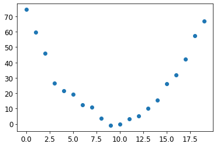
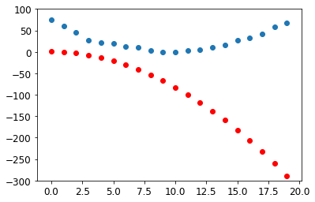

# Brief Look at Stochastic Gradient Descent (SGD) 

## Loss as a Function w.r.t. Weight Parameters 

Whenever we train a model, we want to know what kind of weights we want to assign each variable, 
such that loss is minimized. We can actually plot a function that describes this behavior - in a 
simple example, take `f(x) = x**2`. Suppose `f(x)` is loss, given a particular weight 
parameter `x`. In this case, we find that loss is at its lowest when the parameter `x = 0`.

SGD is the process in which we find these minimums and use them for adjusting our weights. 
Since the goal of our model is to adjust weights such that loss is minimized, and we can turn 
this into a function, we turn to calculus and use gradients to observe where our parameters 
should be "going".

For example, if we arbitrarily begin at `x = -1.5`, we should increase `x` to minimize loss. 
Why? Because the function is decreasing at `x = -1.5`. So we set `x = -1`, find out that the 
function is still decreasing, then `x= -0.75`, and continue on until we hit the function's 
minimum at `x = 0`.

```python
plot_function(f, 'x', 'x**2')
plt.scatter(-1.5, f(-1.5), color='red')
plt.show()
```

In actual models there will be many weights, so in reality we're dealing with multivariable 
functions - exactly how the gradient is calculated for those kind of functions is a calculus 
question (Jacobians and Chain Rule). For now, just know that we can calculate the gradient of 
a particular function at a particular value using a few special functions.

## Calculating the Gradient (Backpropagation)

First we mark a tensor, essentially saying that this set of variables requires gradient 
calculations. This is necessary because there are instances where you will have a different 
set of variables that are inputs, but whose derivatives are not required. 

```python
xt = tensor(3.).requires_grad_()
print(xt)
```

`tensor(3., requires_grad=True)`

We pass that marked tensor containing the value `x` we want to calculate the gradient at into the 
function. Right now, no gradients are being returned; the tensor that is returned contains the 
value at `f(x)`, and is marked with the gradient function that will be used when asked to 
calculate the gradient at that `x` value.

```python
yt = f(xt)
print(yt)
```

`tensor(9., grad_fn=<PowBackward0>)`

Now, we'll use a vector argument instead of a scalar argument.

```python
xt = tensor([3., 4., 10.]).requires_grad_()
yt = f(xt)
yt.backward()
print(xt.grad)
```

`tensor([ 6.,  8., 20.])`

Notice a few changes; first, that `f(x)` has been modified to return a scalar value instead of 
a vector - which has some implications.

```python
def f(x): return (x**2).sum()
print(yt)
```

`tensor(125., grad_fn=<SumBackward0>)`

This is because `backward()` by default only works on scalar outputs - this is because the 
expected out is a scalar loss function. This makes more sense if you understand the chain rule 
and the computational graph implementation, so that's beyond the scope of this simple explanation.

Note that all we've done is calculate the gradient - this action in itself isn't SGD, but 
backpropagation. Backpropagation and calculating the gradient are synomyms - SGD refers to the 
entire learning process (that requires knowing the gradient of our loss function).

At this point, the gradient tells us "where to go", but not "how far we should move". 
What is the best rate to approach the minimum at? This is a question of what our 
**learning rate** should be. 

# End to End SGD Example
Our goal here is to examine how finding a minimum of a loss function can be use to train a model 
to fit data better. Source code of this end to end example is under `sgd.py`.

## Setup
Suppose we're attempting to model the velocity curve of a rollercoaster approaching, climbing, and 
descending a hill. We'll model our speed off of a quadratic equation, with added noise.

```python
# suppose we are trying to model velocity of a rollercoaster, given our recorded data points
time = torch.arange(0,20).float();
print(time)
```
`tensor([ 0.,  1.,  2.,  3.,  4.,  5.,  6.,  7.,  8.,  9., 10., 11., 12., 13., 14., 15., 16., 17., 18., 19.])`

```python
# model speed off of a quadratic equation, with some added noise
speed = torch.randn(20)*3 + 0.75*(time-9.5)**2 + 1
plt.scatter(time,speed)
plt.show()
```


It would be incredibly difficult and time-consuming to find a function that perfectly fits this 
line. Instead, we'll use a model (model in the sense of a function that approximates reality). 
Here, we'll assume the function is some sort of quadratic equation of the form 
`at^2 + bt + c`. That way, we only have to guess three numbers:

```python
# we assume the function is some quadratic; we distinguish b/t the input and the parameters
def f(t, params):
    a,b,c = params
    return a*(t**2) + (b*t) + c
```

Since we'll be making guesses at what these parameters should be, it would be pertinent to 
craft a loss function that tells us if our guess is close or far from the actual solution:

```python
# in order to find the best set of params that fits the true function, we need a loss function that tells us how good our guess is
# use good old mse to measure distance b/t our predicted points and actual target points
def mse(preds, targets): return ((preds-targets)**2).mean()
```

## Steps

### Initialize parameters
Since this is our first run, we'll just make a guess using random parameters; ensure that 
we mark this tensor as requiring gradients.

```python
# step 1: random init
# generate 3 random nums as a tensor, then mark to track gradients
params = torch.randn(3).requires_grad_()
```

### Calculate predictions
We apply our guess and see how it stacked up to the true solution: 

```python
# step 2 calc preds
preds = f(time, params)
show_preds(preds)
plt.show()
```


### Calculate loss
We compare how far off the guess was from the true solution:

```python
# step 3 calc loss
loss = mse(preds, speed)
print(loss)
```

`tensor(25823.8086, grad_fn=<MeanBackward0>)`

### Calculate gradients
Now, we need to know where our initial guess should go to get closer the the true solution: 

```python
# step 4 calc gradients
loss.backward()
print(params.grad)
```

`tensor([-53195.8594,  -3419.7146,   -253.8908])`

We also need to establish a learning rate. For now, we'll pick `1e-5`, or `0.00001`:

```python
print(params.grad * 1e-5)
print(params)
```
`tensor([-0.5320, -0.0342, -0.0025])`

`tensor([-0.7658, -0.7506,  1.3525], requires_grad=True)`

### Step the weights
Now that we know how far away our guess was from the true quadratic function AND what direction 
we need to point our parameters to in order to reach that true function, we establish a 
modest learning rate applied in the direction of our gradients, on our data.

```python
# step 5 step the weights
lr = 1e-5
params.data -= lr * params.grad.data
params.grad = None
```
We clear the gradients on `params` since we've changed the data the gradients were based on.
In fact, you might be wondering why `backward()` was called on the loss function instead of 
`f`, the actual predicting function. Indeed, loss is actually a composition of functions 
`loss = mse(f(t, params))`. As such, PyTorch uses the chain rule to calculate the gradients 
w.r.t. `params`, because we marked it as requiring gradients!
