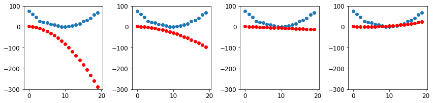

# Brief Look at Stochastic Gradient Descent (SGD) 

## Loss as a Function w.r.t. Weight Parameters 

Whenever we train a model, we want to know what kind of weights we want to assign each variable, 
such that loss is minimized. We can actually plot a function that describes this behavior - in a 
simple example, take `f(x) = x**2`. Suppose `f(x)` is loss, given a particular weight 
parameter `x`. In this case, we find that loss is at its lowest when the parameter `x = 0`.

SGD is the process in which we find these minimums and use them for adjusting our weights. 
Since the goal of our model is to adjust weights such that loss is minimized, and we can turn 
this into a function, we turn to calculus and use gradients to observe where our parameters 
should be "going".

For example, if we arbitrarily begin at `x = -1.5`, we should increase `x` to minimize loss. 
Why? Because the function is decreasing at `x = -1.5`. So we set `x = -1`, find out that the 
function is still decreasing, then `x= -0.75`, and continue on until we hit the function's 
minimum at `x = 0`.

```python
plot_function(f, 'x', 'x**2')
plt.scatter(-1.5, f(-1.5), color='red')
plt.show()
```

In actual models there will be many weights, so in reality we're dealing with multivariable 
functions - exactly how the gradient is calculated for those kind of functions is a calculus 
question (Jacobians and Chain Rule). For now, just know that we can calculate the gradient of 
a particular function at a particular value using a few special functions.

## Calculating the Gradient (Backpropagation)

First we mark a tensor, essentially saying that this set of variables requires gradient 
calculations. This is necessary because there are instances where you will have a different 
set of variables that are inputs, but whose derivatives are not required. 

```python
xt = tensor(3.).requires_grad_()
print(xt)
```

`tensor(3., requires_grad=True)`

We pass that marked tensor containing the value `x` we want to calculate the gradient at into the 
function. Right now, no gradients are being returned; the tensor that is returned contains the 
value at `f(x)`, and is marked with the gradient function that will be used when asked to 
calculate the gradient at that `x` value.

```python
yt = f(xt)
print(yt)
```

`tensor(9., grad_fn=<PowBackward0>)`

Now, we'll use a vector argument instead of a scalar argument.

```python
xt = tensor([3., 4., 10.]).requires_grad_()
yt = f(xt)
yt.backward()
print(xt.grad)
```

`tensor([ 6.,  8., 20.])`

Notice a few changes; first, that `f(x)` has been modified to return a scalar value instead of 
a vector - which has some implications.

```python
def f(x): return (x**2).sum()
print(yt)
```

`tensor(125., grad_fn=<SumBackward0>)`

This is because `backward()` by default only works on scalar outputs - this is because the 
expected out is a scalar loss function. This makes more sense if you understand the chain rule 
and the computational graph implementation, so that's beyond the scope of this simple explanation.

Note that all we've done is calculate the gradient - this action in itself isn't SGD, but 
backpropagation. Backpropagation and calculating the gradient are synomyms - SGD refers to the 
entire learning process (that requires knowing the gradient of our loss function).

At this point, the gradient tells us "where to go", but not "how far we should move". 
What is the best rate to approach the minimum at? This is a question of what our 
**learning rate** should be. 

## Wait... why do we need a learning rate? Just set the gradient equal to zero, right?

If you recall from your Calculus 101 course, we can find the minimums of a function by 
- Finding the derivative
- Setting the derivative equal to zero

Like so:

```math
\begin{aligned}
f(x) &= x^2 + 5  \\
f'(x) &= 2x \\
f'(x) &= 2x = 0 \\
\end{aligned}
```
`f(x) has a minimum at x = 0`

So if the goal is find the minimum loss, why bother with learning rates? Can't we just 
analytically find the minimums of a function by setting its gradient equal to zero? 

The answer is... yesn't.

Fundamentally, something like `f(x) = x^2` is a toy problem - the kind of functions that 
you will encounter are much more complicated; indeed, some may not even be differentiable 
everywhere, and some may be so complex as to repel analytical solutions. Take

```math
x^7+x^3-5^2+e^x+log(x+x^2)+1/x=0
```

How do you solve for this analytically? (hint: you can't)

Instead, you need to use numerical methods - an approximate computer method for 
solving a mathematical problem which often has no analytical solution. 
[[1]](https://www.sciencedirect.com/topics/engineering/numerical-method) 

These involve iterative methods (in our case, gradient + learning rate), which may not 
be the actual true answer, but gets you acceptably close. 

You can learn more about why gradient descent is required: 
- [Why gradient descent is required](https://stats.stackexchange.com/questions/212619/why-is-gradient-descent-required/212715#212715) 
- [Cases where gradient descent outperforms the analytical solution](https://stats.stackexchange.com/questions/23128/solving-for-regression-parameters-in-closed-form-vs-gradient-descent/23132#23132)

# End to End SGD Example
Our goal here is to examine how finding a minimum of a loss function can be use to train a model 
to fit data better. Source code of this end to end example is under `sgd.py`.

## Setup
Suppose we're attempting to model the velocity curve of a rollercoaster approaching, climbing, and 
descending a hill. We'll model our speed off of a quadratic equation, with added noise.

```python
# suppose we are trying to model velocity, given our recorded data points from [0, 20)
time = torch.arange(0,20).float();

# model speed off of a quadratic equation, with some added noise
speed = torch.randn(20)*3 + 0.75*(time-9.5)**2 + 1
plt.scatter(time,speed)
plt.show()
```


It would be incredibly difficult and time-consuming to find a function that perfectly fits this 
line. Instead, we'll use a model (model in the sense of a function that approximates reality). 
Here, we'll assume the function is some sort of quadratic equation of the form 
`at^2 + bt + c`. That way, we only have to guess three numbers:

```python
# we assume the function is some quadratic; we distinguish b/t the input and the parameters
def f(t, params):
    a,b,c = params
    return a*(t**2) + (b*t) + c
```

Since we'll be making guesses at what these parameters should be, it would be pertinent to 
craft a loss function that tells us if our guess is close or far from the actual solution:

```python
# in order to find the best set of params that fits the true function, we need a loss function that tells us how good our guess is
# use good old mse to measure distance b/t our predicted points and actual target points
def mse(preds, targets): return ((preds-targets)**2).mean()
```

## Steps

### Initialize parameters
Since this is our first run, we'll just make a guess using random parameters; ensure that 
we mark this tensor as requiring gradients. We're also going to save these original parameters 
to use for visualization plots later down the line.

```python
# step 1: random init
# generate 3 random nums as a tensor, then mark to track gradients
params = torch.randn(3).requires_grad_()
orig_params = params.clone() # used later for plots
```

### Calculate predictions
We apply our guess and see how it stacked up to the true solution: 

```python
# step 2 calc preds
preds = f(time, params)
show_preds(preds)
plt.show()
```


### Calculate loss
We compare how far off the guess was from the true solution:

```python
# step 3 calc loss
loss = mse(preds, speed)
print('loss b/t true and initial prediction:', loss)
```

`loss b/t true and initial prediction: tensor(25823.8086, grad_fn=<MeanBackward0>)`

### Calculate gradients
Now, we need to know where our initial guess should go to get closer the the true solution: 

```python
# step 4 calc gradients
loss.backward()
print('params.grad:', params.grad)
```

`tensor([-53195.8594,  -3419.7146,   -253.8908])`

We also need to establish a learning rate. For now, we'll pick `1e-5`, or `0.00001`:

```python
print('params.grad * learning rate:', params.grad * 1e-5)
print('params:', params)
```
`params.grad * learning rate: tensor([-0.5320, -0.0342, -0.0025])`

`params: tensor([-0.7658, -0.7506,  1.3525], requires_grad=True)`

### Step the weights

Now that we know how far away our guess was from the true quadratic function AND what direction 
we need to point our parameters to in order to reach that true function, we establish a 
modest learning rate applied in the direction of our gradients, on our data.

```python
# step 5 step the weights
lr = 1e-5
params.data -= lr * params.grad.data
params.grad = None
```
The line `params.data = params.data - lr * params.grad.data` is worth investigating since I 
clearly forgot calculus. 
This line will always point `params` to the local minimum. If the gradient is positive, then our 
loss function is increasing, meaning we need to go back (smaller values of `params`). 
Then, `- lr * params.grad.data` will be negative, pulling our weights back towards the minimum. 
If the gradient is negative, then our loss function is decreasing, meaning we are on the right 
path (so we desire larger value of `params`). Then `- lr * params.grad.data` will be positive, 
meaning we will have a larger value of `params` moving toward a minimum. Here's a picture 
detailing this:


We clear the gradients on `params` since we've changed the data the gradients were based on.

Now, we'll use these new params on our quadratic function, and check the loss.

```python
preds = f(time, params)
print('mse b/t true and new prediction:', mse(preds, speed))
show_preds(preds)
plt.show()
```

`mse b/t true and new prediction: tensor(5435.5366, grad_fn=<MeanBackward0>)`


Now that we know how the step works, we'll craft a function that does exactly that, since we'll 
be using it a few times to improve loss.

```python
# function to step more times
def apply_step(params, prnt=True):
    preds = f(time, params)
    loss = mse(preds, speed)
    loss.backward()
    params.data -= lr * params.grad.data
    params.grad = None
    if prnt: print('loss:', loss.item())
    return preds
```

To recap, we use our parameters craft a new quadratic function. We calculate the difference 
between the new function and the true function, and calculate the gradients w.r.t. the parameters 
so that our gradients point to the direction of the true function. We update our parameters 
to move in that direction, but with a controlled learning rate. We reset the gradients so they 
are recalculated by PyTorch, print out the loss of this new function, and return the prediction 
that was based off of the initial parameters passed into `apply_step`.

One thing to note is that the contents of the `param` tensor DOES change despite being in a 
function. The `param` reference doesn't change, but the values contained in that reference do.

### Repeat
At this point we're just going to repeat the prediction, loss calculation, gradient calculation, 
and weight stepping process for the next 10 iterations.

```python
# step 6 repeat
print('\nrepeat step')
for i in range(10): 
    print('step', i,':', 'current params:', params) 
    apply_step(params)
```
```
repeat step
step 0 : current params: tensor([-0.5714, -0.1194, -1.2677], requires_grad=True)
loss: 15462.8564453125
step 1 : current params: tensor([-0.1637, -0.0933, -1.2657], requires_grad=True)
loss: 3486.992919921875
step 2 : current params: tensor([ 0.0137, -0.0819, -1.2647], requires_grad=True)
loss: 1220.79150390625
step 3 : current params: tensor([ 0.0908, -0.0770, -1.2642], requires_grad=True)
loss: 791.9537963867188
step 4 : current params: tensor([ 0.1244, -0.0749, -1.2638], requires_grad=True)
loss: 710.8018798828125
step 5 : current params: tensor([ 0.1390, -0.0739, -1.2636], requires_grad=True)
loss: 695.4423828125
step 6 : current params: tensor([ 0.1453, -0.0736, -1.2634], requires_grad=True)
loss: 692.5330810546875
step 7 : current params: tensor([ 0.1481, -0.0734, -1.2632], requires_grad=True)
loss: 691.9796752929688
step 8 : current params: tensor([ 0.1493, -0.0733, -1.2630], requires_grad=True)
loss: 691.8720092773438
step 9 : current params: tensor([ 0.1498, -0.0733, -1.2628], requires_grad=True)
loss: 691.8487548828125
```

We can also visualize the quadratic equations our process is producing like so:

```python
# use original params for better visuals, since after 10 steps there's not much change to be seen
params = orig_params.detach().requires_grad_()  

_,axs = plt.subplots(1,4,figsize=(12,3))
for ax in axs: show_preds(apply_step(params, False), ax)
plt.tight_layout()
plt.show()
```


### Stop
For this example, we arbitrarily decide to stop after 10 steps (instead of, say, waiting for a max 
time or reaching a specific loss value).

## Summary of SGD

*init, calculate preds*:  
We begin by choosing some random weight parameters and testing how those parameters fare against 
our training data.

*calculate loss*:  
Recall that our overarching goal is to find the parameter weights that are the "best".
But what is "best", and how do we measure it? Being the best means finding the weights that 
result in our model performing well; e.g. a classifier being able to accurately classify 
images it is being trained with. We measure "bestness" through a **loss function** - a 
measure of how close a model is to reality, given its weight parameters. So what does the curve 
generated by the loss function tell us? The max of this function would imply that the given inputs 
generate answers that are farther off from reality. Meanwhile, the minimum of this function would 
entail that the given set of weights produce answers that are closer to reality. That is, our 
goal should be to traverse the curve of the loss function, and find where there is minimum loss, 
since those would contain the weights that result in the model more closely fitting reality.

*calculate gradients*:  
When we traverse this curve, we are really asking what direction the curve is going. We turn to 
the **gradient** to answer our question. By calculating the gradient of our loss function 
(w.r.t. our weight parameters), the gradient tells us what "direction" our function is going. 
So if we know our function is going "lower" (loss is shrinking), then we are on the right path. 
If our function is going "higher" (loss is growing), then we are going in the wrong direction. 

*step the weights*:  
But even if we know what direction we should be "walking" towards, how far should we go? We 
use **learning rate** so that we step in the direction of the minimum in a controlled manner. 
Ideally this learning rate isn't too steep as too hop over the minimum, and not too shallow as 
to take an exorbitant amount of time to reach our minimum. 

*repeat, stop*:  
We repeat this process until we decide to stop, where we ideally have found the set of weight 
parameters that places us snugly in a local minimum of our loss function. 
